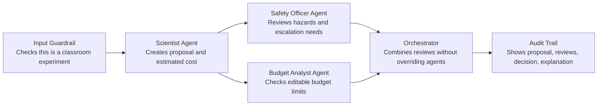

# Applied Agentic AI Course - Student Demo

## MadScience Experiments

by Naresh Raheja

June 25, 2026

---

# Simple Agentic Flow

| Example Field | Classroom Example |
| --- | --- |
| Input | Water quality and radish seed growth |
| Guardrail | Valid classroom experiment |
| Review | Household materials and cost within limit |
| Final Decision | APPROVED with audit trail |

---

# Inspired by Classroom Python Files

| MadScience Component | Inspired By | What It Demonstrates |
| --- | --- | --- |
| Input validation | `03-01-a-input-guardrail-simple.py` / `03-01-b-input-guardrail-classifier.py` | Checks whether the user goal is a valid classroom experiment |
| Safety rules | `04-01-tool-guardrail.py` | Prevents unsafe experiment paths from being approved |
| Human review | `04-02-hitl-approval.py` | Escalates ambiguous, outdoor, or student-data cases |
| Agent handoffs | `09-handoff-agents.py` | Coordinates Scientist, Safety Officer, and Budget Analyst agents |
| Rejection criteria lookup | `12-rag-agent.py` | Reads rejection and modification criteria from a small policy file |

Live demo: [madscience-cyan.vercel.app](https://madscience-cyan.vercel.app/)

---

# Iterative Changes

| Iteration | What Changed | Result |
| --- | --- | --- |
| 1 | Replaced fixed demo matching with goal-aware proposals | New topics keep their own context |
| 2 | Added cost input and editable budget limits | Presenter controls approve/modify/reject thresholds |
| 3 | Expanded safety guardrails | High voltage, hazardous materials, biological agents, explosives, and high heat reject |
| 4 | Added experiment logic check | Non-actionable goals are marked invalid before review |
| 5 | Tuned classroom safety | Seed growth can approve; outdoor samples still require controls |
