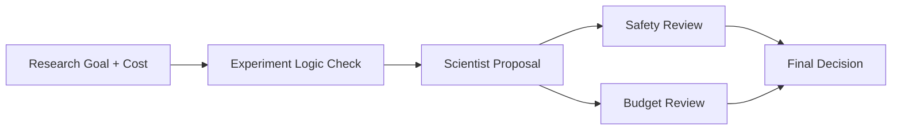

# Applied Agentic AI Course - Student Demo

## MadScience Experiments

by Naresh Raheja

June 25, 2026

---

# Design and Implementation Steps

| Design Area | Classroom Demo Choice |
| --- | --- |
| Guardrails | Invalid goals and dangerous experiments are stopped before approval |
| Agents | Scientist proposes, Safety Officer reviews risk, Budget Analyst checks limits |
| Traceability | Every decision is shown in the audit trail |
| Publishing | GitHub repository `spv1/madscience` deployed on Vercel |

Live demo: [madscience-cyan.vercel.app](https://madscience-cyan.vercel.app/)

---

# Iterative Changes

| Iteration | What Changed | Result |
| --- | --- | --- |
| 1 | Replaced fixed demo matching with goal-aware proposals | New topics keep their own context |
| 2 | Added cost input and editable budget limits | Presenter controls approve/modify/reject thresholds |
| 3 | Expanded safety guardrails | High voltage, hazardous materials, biological agents, explosives, and high heat reject |
| 4 | Added experiment logic check | Non-actionable goals are marked invalid before review |
| 5 | Tuned classroom safety | Seed growth can approve; outdoor samples still require controls |
